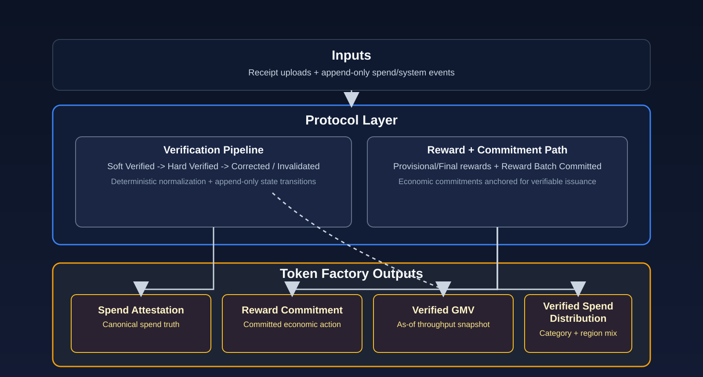

<div align="center">

# Crinkl Protocol

[](versions/CHANGELOG.md)
[](LICENSE)
[](https://github.com/crinkl-protocol/crinkl-protocol-spec/actions/workflows/drift-check.yml)
[](formal/CrinklProtocol.tla)

**Turn receipts into cryptographic proof of commerce.**

An open protocol for producing identity-free, cryptographically signed spend attestations from raw receipt data — portable proof that commerce happened, without revealing who.

</div>

---

<p align="center">
  
</p>

**Key properties:** Deterministic | Replayable | Append-only | Cryptographically linked (SHA-256) | Signed (Ed25519)

---

## Quick Start

1. **[INTRODUCTION.md](protocol/INTRODUCTION.md)** — What the protocol does
2. **[GLOSSARY.md](protocol/GLOSSARY.md)** — Locked definitions (attestation, commitment, etc.)
3. **[MODEL.md](protocol/MODEL.md)** — Core concepts (5 min read)
4. **[TOKENS.md](protocol/TOKENS.md)** — Token outputs (spend attestation, reward commitments, Verified GMV, Verified Spend Distribution)
5. **[DATA_STRUCTURES.md](protocol/DATA_STRUCTURES.md)** — Schemas and normalization rules
6. **[Test Vectors](reference/EXAMPLES.md)** — 60+ cases

## Export PDF

Build a single PDF from the Markdown spec using Dockerized Pandoc (no local Pandoc install required):

```bash
./scripts/export_protocol_pdf.sh
```

Output: `dist/crinkl-protocol.pdf`

## Structure

```
/protocol    — Normative specification
/reference   — Implementation guidance, examples, JSON schemas
/versions    — Changelog and version snapshots
/diagrams    — Visual material
/formal      — TLA+ model checking specifications
```

## Key Properties

| Property | Guarantee |
|----------|-----------|
| Deterministic | Same input + protocolVersion = same output |
| Replayable | Final state reconstructible from events alone |
| Append-only | Ledgers grow; entries never deleted |
| Cryptographically linked | Events chained via prevHash |
| Signed | Ed25519 signatures on all events |

## Cryptographic Specifications

| Component | Specification |
|-----------|---------------|
| Serialization | RFC 8785 (JSON Canonicalization) |
| Hash | SHA-256, lowercase hex |
| Signature | Ed25519, base64 |

## Protocol Documents

| Document | Purpose |
|----------|---------|
| [PROTOCOL_V1.md](protocol/PROTOCOL_V1.md) | Top-level spec |
| [GLOSSARY.md](protocol/GLOSSARY.md) | Normative term definitions |
| [MODEL.md](protocol/MODEL.md) | Domain model |
| [TOKENS.md](protocol/TOKENS.md) | Token outputs (spend attestation, reward commitments, Verified GMV, Verified Spend Distribution) |
| [DATA_STRUCTURES.md](protocol/DATA_STRUCTURES.md) | Schemas, normalization |
| [STATE_MACHINES.md](protocol/STATE_MACHINES.md) | State transitions |
| [EVENTS.md](protocol/EVENTS.md) | Event definitions |
| [VERIFICATION_PIPELINE.md](protocol/VERIFICATION_PIPELINE.md) | Verification flow |
| [REWARD_LAYER.md](protocol/REWARD_LAYER.md) | Reward issuance |
| [COMMITMENT_LAYER.md](protocol/COMMITMENT_LAYER.md) | On-chain reward proofs |
| [TOKEN_EXTENSIONS.md](protocol/TOKEN_EXTENSIONS.md) | Privacy-first credentials + agent delegation (draft) |
| [SECURITY_MODEL.md](protocol/SECURITY_MODEL.md) | Threat model |
| [RATE_LIMITING.md](protocol/RATE_LIMITING.md) | Rate limits |
| [PROTOCOL_EVOLUTION.md](protocol/PROTOCOL_EVOLUTION.md) | Versioning |

## Wire Formats

| Format | Location | Status | Use Case |
|--------|----------|--------|----------|
| JSON Schema | [event.schema.json](reference/schemas/event.schema.json) | Normative (for JSON) | Validation + interop |
| Conformance Vectors | [conformance/v1](conformance/v1) | Normative | Canonicalization, hashing, signatures, Merkle roots/proofs |

## Formal Verification

TLA+ specification: [formal/CrinklProtocol.tla](formal/CrinklProtocol.tla)

Verified invariants:
- No reward without verification
- Final reward requires hard verification
- Corrections only after finalization
- Rewards are immutable (no clawback)

## Current Version

**v1.0.0-rc.1** — See [CHANGELOG.md](versions/CHANGELOG.md)  
Planned stable release tag: **v1.0.0**

## Provenance

Publication and history notes: [PROVENANCE.md](PROVENANCE.md)

## Verification

- Drift check: `python3 scripts/check_drift.py`
- Conformance checks: `node scripts/verify_conformance.mjs`
- Formal model check: `bash scripts/run_tlc.sh`
