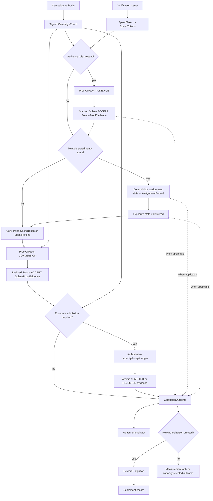

# Campaign architecture diagram

Status: target specification; `SPECIFIED_NOT_IMPLEMENTED` unless the
implementation matrix says otherwise.

The frozen Solana verifier program accepts exact proof subjects under
Procedure Profile V3, and the relying Consumer reconstructs the finalized
`ACCEPT` as `SolanaProofEvidenceV1`. Neither produces assignment, economic
admission, Outcomes, obligations, or settlement. The procedure has
`stateTransition = NONE`; the program's `ACCEPT` record blocks exact proof
replay only, and any capacity, Reward Ledger, or settlement state change names
its own authoritative registry, ledger, or chain.
